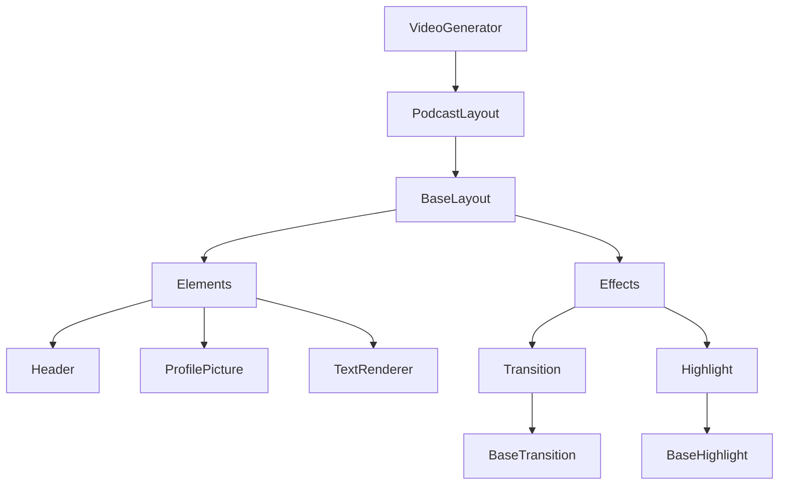

# Advanced Video Effects with Progressive Disclosure of Complexity

> - **Author**: [@mratanusarkar](https://github.com/mratanusarkar)
> - **Created**: April 16, 2025
> - **Last Updated**: April 17, 2025
> - **Compatible with**: Audim v0.0.3

This example explores Audim's implementation of the "progressive disclosure of complexity" design principle through the `effects` module in the `sub2pod` package. We'll demonstrate how Audim provides a smooth learning curve for users of all experience levels.

## What is Progressive Disclosure of Complexity?

Progressive disclosure of complexity is a design principle that gradually reveals advanced functionality as users become more experienced with a system. This concept originated in UI design but has been adapted for API design in software libraries.

As described by design experts:

> "Progressive disclosure is an interaction design technique that sequences information and actions across several screens in order to reduce feelings of overwhelm for the user."
> 
> — [Interaction Design Foundation](https://www.interaction-design.org/literature/book/the-glossary-of-human-computer-interaction/progressive-disclosure)

Specially in module or library design, this principle is realized by creating higher level APIs and lower level APIs. While the lower level APIs are granular, fundamental, small and rigid catering to specific functionalities of the module or library. The higher level APIs are complex and formed by combining the lower level APIs catering to specific end user requirements and use cases.

This results in end users using the higher level APIs with ease, getting out of the box experience, while also being able to dig deeper into the lower level APIs for specific customizations when needed.

The best way to put it is to quote the creator of Keras:

> "A key design principle I follow in libraries (e.g. Keras) is 'progressive disclosure of complexity'. Make it easy to get started, yet make it possible to handle arbitrarily flexible use cases, only requiring incremental learning at each step."
> 
> — [François Chollet](https://x.com/fchollet/status/1231285340335267840)

This approach is used by many popular libraries like [Keras](https://keras.io/getting_started/about/#keras-follows-the-principle-of-progressive-disclosure-of-complexity), [Hugging Face Transformers](https://huggingface.co/blog/transformers-design-philosophy), [Hugging Face Diffusers](https://huggingface.co/docs/diffusers/en/conceptual/philosophy) and many more allowing users to:

- Start simple with sensible defaults
- Incrementally discover more advanced features
- Access the full power of the library when needed

## How Audim's `sub2pod` submodule Implements Progressive Disclosure

Audim's `sub2pod` submodule implements progressive disclosure of complexity through a carefully designed hierarchy of abstractions:

1. **High-Level API (`VideoGenerator` & `PodcastLayout`)**
    - `VideoGenerator` takes care of video generation and rendering
    - `PodcastLayout` takes care of how each frames in the video will look like
    - Provides out-of-the-box functionality for podcast video generation
    - Offers sensible defaults for all parameters
    - Perfect for users who want to get started quickly

2. **Mid-Level API (`BaseLayout`)**
    - Allows customization of layouts, elements in the layout and it's effects
    - Provides string-based configuration for common use cases
    - Enables users to put together various elements and effects to create their own layouts
    - It's like a lego or a puzzle piece where lower level elements and effects can be used to create new layouts
    - Ideal for users who want to customize their videos

3. **Lower-Level API (`Header`, `Profile`, `Text` Elements and `Transition`, `Highlight` Effects)**
    - Offers complete control over each elements and effects
    - These elements are the fundamental building blocks that Audim provides
    - These effects are the fundamental animations that Audim provides
    - These elements and effects can be combined to create new layouts and animations

4. **Lowest-Level API (`BaseElement` & `BaseEffect`)**
    - Offers complete control over rendering and effects
    - Allows creation of custom elements and effects
    - Provides access to all parameters and methods
    - Designed for power users and developers

So, by providing API abstractions from higher levels to the lower levels, Audim's `sub2pod` submodule allows users to:

- Start using and generation podcast videos out of the box with sensible defaults
- Incrementally discover more advanced features and customizations when needed
- Access the full power of the library when needed with fine-tuned control over the layouts, elements and effects
- Power users can also implement their own custom layouts, elements and effects by overriding `BaseLayout`, `BaseElement` and `BaseEffect` classes.

This layered approach creates a natural progression path for users:

```python
# Level 1: High-Level API (Simple)
layout = PodcastLayout(...)
generator = VideoGenerator(layout)
generator.generate_from_srt(...)
```

```python
# Level 2: Mid-Level API (Customization)
layout.set_transition_effect("fade")
layout.set_highlight_effect("none")
```

```python
# Level 3: Low-Level API
class CustomEffect(BaseEffect):
    # Override for full customization and control
    def apply(self, frame, progress):
        # Custom effect implementation
        pass
```

So, the abstraction layers and inheritance hierarchy of Audim's `sub2pod` submodule can be visualized as follows:



## Why this is powerful?

### 1. Progressive Disclosure of Complexity

This approach creates a natural hierarchy of complexity:

- **Simple level**: Users choose a pre-configured layout with default effects
- **Intermediate level**: Users customize effects for elements on existing layouts
- **Advanced level**: Users create custom layouts with custom elements and effects

This matches how video editors typically work - first selecting templates, then adjusting effects, and finally creating custom compositions when needed.

### 2. End User Experience

For video creators and editors, this model is intuitive because:

- It follows familiar mental models from tools like OBS, Premiere Pro, and After Effects
- Effects are naturally tied to how content appears (the layout)
- The separation keeps the API clean while maintaining flexibility
- Users can think in terms of "scenes" (layouts) that have both positioning and visual effects

### 3. Developer Experience

For developers and power users, this architecture provides:

- Clear extension points for adding new features
- Well-defined interfaces between components
- Easy testing and maintenance of individual components
- Ability to mix and match different levels of abstraction

### 4. Performance and Maintainability

The layered architecture also benefits the codebase itself:

- Each layer can be optimized independently
- Changes in one layer don't affect others
- Easier to add new features without breaking existing code
- Better separation of concerns

## How the new `effects` module Implements Progressive Disclosure

Audim's `effects` module provides transition and highlight effects for videos with three distinct levels of complexity:

1. **Level 1: Default Usage** - No configuration needed
2. **Level 2: Simple Customization** - Basic string-based configuration
3. **Level 3: Advanced Customization** - Detailed parameter configuration

This approach allows beginners to get started quickly while giving advanced users the power and flexibility they need.

## Example: Three Levels of Complexity

Let's explore how you can use Audim's effects at different complexity levels:

### Level 1: Default Usage (No Configuration)

The simplest way to use Audim is with default settings. The `PodcastLayout` automatically includes a default fade transition:

```python
from audim.sub2pod.layouts.podcast import PodcastLayout
from audim.sub2pod.core import VideoGenerator

# Create a podcast layout with default effects
layout = PodcastLayout(
    video_width=1920, 
    video_height=1080,
    show_speaker_names=True
)

# Add speakers
layout.add_speaker("Host", "input/host.png")
layout.add_speaker("Guest", "input/guest.png")

# Create generator with this layout
generator = VideoGenerator(layout)

# The layout will automatically use the default effects
# No explicit configuration needed!
```

At this level, users don't need to know anything about effects - they just work.

### Level 2: Simple Customization

As users become more comfortable, they can easily customize effects by simply specifying the effect type:

```python
# Create podcast layout
layout = PodcastLayout(
    video_width=1920,
    video_height=1080,
    show_speaker_names=True
)

# Simple customization - just specify effect type
layout.set_transition_effect("fade")
layout.set_highlight_effect("glow")

# Add speakers and generate video as before
```

This level introduces a clean, string-based API that's easy to understand and use.

### Level 3: Advanced Customization

Power users can access detailed customization options when they need fine-grained control:

```python
# Create podcast layout
layout = PodcastLayout(
    video_width=1920,
    video_height=1080,
    show_speaker_names=True
)

# Advanced customization with detailed parameters
layout.set_transition_effect(
    "slide", 
    frames=25,                  # Longer transition (default: 15 frames)
    direction="left"            # Slide in from left
)

layout.set_highlight_effect(
    "pulse",
    color=(255, 215, 0, 100),   # Custom gold color, semi-transparent
    min_size=0.9,               # Subtle pulse (90% to 110% size)
    max_size=1.1,
    blur_radius=8               # More blur for softer effect
)

# Add speakers and generate video as before
```

At this level, users have complete control over every aspect of the effects.

## Full Implementation Example

Here's how you might use Audim's `sub2pod` submodule in a complete project:

```python
from datetime import datetime
from audim.sub2pod.layouts.podcast import PodcastLayout
from audim.sub2pod.core import VideoGenerator

# Create a podcast layout
print("Creating layout...")
layout = PodcastLayout(
    video_width=1920,
    video_height=1080,
    show_speaker_names=True
)

# Set custom effects for the layout
layout.set_transition_effect("fade", frames=20)
layout.set_highlight_effect("none")

# Add speakers
print("Adding speakers...")
layout.add_speaker("Grant Sanderson", "input/grant.png")
layout.add_speaker("Sal Khan", "input/sal.png")

# Generate video
print("Generating video...")
generator = VideoGenerator(layout, fps=30)
generator.generate_from_srt(
    srt_path="input/podcast.srt",
    audio_path="input/podcast.mp3",
    logo_path="input/logo.png",
    title="3b1b Podcast: Sal Khan: Beyond Khan Academy",
    cpu_core_utilization="max"
)

# Export the final video
print("Exporting video...")
datetime = datetime.now().strftime("%Y%m%d%H%M%S")
generator.export_video(f"output/podcast_underline_{datetime}.mp4")
```

Here's how the generated video looks like upon completion of the rendering process:

<div style="text-align: center; margin: 20px 0;">
  <video controls style="width: 100%;">
    <source src="/examples/assets/podcast_02/podcast.mp4" type="video/mp4">
    Your browser does not support the video element.
  </video>
</div>

## Available Effects

### Transition Effects

Transitions control how each frame fades in or slides into view:

| Effect Type | Description | Parameters |
|-------------|-------------|------------|
| `"none"` | No transition (default) | None |
| `"fade"` | Smooth fade-in transition | `frames`: Duration of fade |
| `"slide"` | Slide-in animation | `frames`: Duration of slide, `direction`: "left", "right", "up", or "down" |

### Highlight Effects

Highlights emphasize the active speaker's text:

| Effect Type | Description | Parameters |
|-------------|-------------|------------|
| `"none"` | No highlight | None |
| `"pulse"` | Pulsing animation | `color`, `min_size`, `max_size`, `blur_radius` |
| `"glow"` | Glowing background | `color`, `blur_radius` |
| `"underline"` | Simple underline | `color`, `thickness` |
| `"box"` | Box around text | `color`, `padding`, `thickness` |

## Benefits of Progressive Disclosure

This design pattern offers several advantages:

1. **Reduced Learning Curve**: New users can be productive immediately without being overwhelmed
2. **Smooth Progression**: Users can gradually discover more advanced features as they need them
3. **Documentation Organization**: Documentation can target different user groups based on expertise
4. **API Cleanliness**: The API remains clean and intuitive at all levels
5. **Flexibility**: Advanced users can access powerful features without sacrificing simplicity for beginners

## Real-World Impact

The progressive disclosure pattern in Audim helps different types of users:

- **Content Creators**: Can quickly generate basic podcast videos without technical knowledge
- **Video Editors**: Can customize effects to match their brand and style
- **Developers**: Can achieve precise control and integrate Audim into larger workflows

## Troubleshooting

If you encounter issues with effects:

- Verify you're using Audim v0.0.3 or later
- Check that effect names are spelled correctly (e.g., "fade" not "fading")
- For slide transitions with text, ensure your text color includes an opacity value
- When using highlight effects, ensure the subtitle area is properly defined

## See Also

- [Basic Podcast Example](./v0.0.1.md)
- [Professional Podcast Example](./v0.0.2.md)
- [API Documentation for Transitions](../audim/sub2pod/effects/transitions.md)
- [API Documentation for Highlights](../audim/sub2pod/effects/highlights.md)
