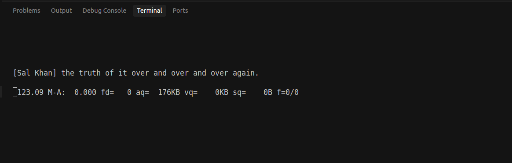

# Automated Podcast Subtitling: From Audio to SRT

> - **Author**: [@mratanusarkar](https://github.com/mratanusarkar)
> - **Created**: Apr 22, 2025
> - **Last Updated**: May 18, 2025
> - **Compatible with**: Audim v0.0.5

This guide demonstrates how to use Audim's `aud2sub` module to automatically generate high-quality subtitles from podcast audio files. We'll also explore the `utils` module for replacing generic speaker labels and manually validating subtitles. The subtitles generated can finally be fed into `sub2pod` to generate podcast videos (as covered in previous examples).

Together, these tools form a powerful foundation for podcast content creation.

## Overview

The audio-to-subtitle workflow involves these key steps:

1. **Transcription**: Converting spoken audio to text
2. **Diarization**: Identifying who spoke which parts
3. **Formatting**: Optimizing subtitles for readability
4. **Validation**: Checking, testing and validating the generated subtitles

Audim handles all these steps with an easy-to-use interface, providing both simple defaults and advanced customization options.

## Prerequisites

Before running this example, ensure you have:

1. Installed Audim with its dependencies: see [installation instructions](../setup/installation.md)
2. An audio file to process (MP3, WAV, or other supported formats) with your podcast audio recording
3. A HuggingFace token for speaker diarization (get one at [huggingface.co/settings/tokens](https://huggingface.co/settings/tokens))

**Note**: See [HuggingFace Token Management](#huggingface-token-management) for more details.


## Basic Usage (High-level API)

The simplest way to generate subtitles from an audio file is:

```python
from audim.aud2sub.transcribers.podcast import PodcastTranscriber
from audim.aud2sub.core import SubtitleGenerator

# Create a transcriber with default settings
transcriber = PodcastTranscriber(model_name="large-v2")

# Generate and export subtitles
generator = SubtitleGenerator(transcriber)
generator.generate_from_mp3("input/podcast.mp3")
generator.export_subtitle("output/podcast.srt")
```

This basic approach works well for most of the cases, using these default settings:
- WhisperX large-v2 model for transcription
- Automatic language detection
- 1-5 speakers for diarization
- Speaker names displayed as "[Speaker 1]", "[Speaker 2]", etc.
- Optimized line length for readability

## Customizing Transcription (Mid-level API)

For more custom use cases, you can configure the transcriber directly during initialization.
You can also use the convenient setters for customizing various aspects of the transcription process:

```python
# Create a transcriber
transcriber = PodcastTranscriber(
    hf_token="YOUR_HUGGINGFACE_TOKEN",
    model_name="large-v3",              # Use newer/larger model for better accuracy
    language="en",                      # Force English language detection  
    device="cuda",                      # Use GPU for faster processing
    compute_type="float16",             # Use half-precision floating point for faster processing
    batch_size=16,                      # Process audio in batches of 16 samples
)

# Customize speaker detection
transcriber.set_speakers(min_speakers=2, max_speakers=6)

# Customize subtitle formatting
transcriber.set_speaker_names_display(True, pattern="[{speaker}]")
transcriber.set_line_properties(max_length=70, min_split_length=50)

# Enable GPU memory management for large files
transcriber.set_memory_management(clear_gpu_memory=True)
```

## Advanced Configuration (Low-level API)

For more advanced use cases, you can override the base transcriber class and implement your own transcriber:

```python
from audim.aud2sub.transcribers.base import BaseTranscriber
from audim.aud2sub.core import SubtitleGenerator

class MyTranscriber(BaseTranscriber):
    def __init__(self, *args, **kwargs):
        super().__init__(*args, **kwargs)
        # Add any custom initialization logic here

    def process_audio(self, audio_path: str) -> None:
        # Add any custom transcription pipeline and logic here
    
    def export_subtitle(self, output_path: str) -> None:
        # Add any custom subtitle export format and logic here

transcriber = MyTranscriber()
generator = SubtitleGenerator(transcriber)
generator.generate_from_mp3("input/podcast.mp3")
generator.export_subtitle("output/podcast.srt")
```

## Complete Subtitling Example

Here's a complete example demonstrating the entire process:

```python
from audim.aud2sub.transcribers.podcast import PodcastTranscriber
from audim.aud2sub.core import SubtitleGenerator

# Create transcriber
print("Creating transcriber...")
transcriber = PodcastTranscriber(
    model_name="large-v2",
    hf_token="YOUR_HUGGINGFACE_TOKEN"
)

# Set speaker detection and subtitle formatting parameters
transcriber.set_speakers(min_speakers=1, max_speakers=5)
transcriber.set_speaker_names_display(True, pattern="[{speaker}]")
transcriber.set_line_properties(max_length=70, min_split_length=50)

# Generate subtitles
print("Generating subtitles...")
generator = SubtitleGenerator(transcriber)

# Process audio file
print("Processing audio...")
generator.generate_from_mp3("input/podcast.mp3")

# Export the final subtitle
print("Exporting subtitles...")
generator.export_subtitle("output/podcast.srt")
print("Done! Check output/podcast.srt for results.")
```

## Validating and Enhancing Subtitles

After generating subtitles, Audim's `utils` module provides tools for validating and enhancing them:

### Replacing Generic Speaker Labels

Generated subtitles use generic labels like "[Speaker 1]" and "[Speaker 2]". You can replace these with actual names:

```python
from audim.utils.subtitle import Subtitle

subtitle = Subtitle()

# Preview replacements before applying
subtitle.preview_replacement(
    "output/podcast.srt",
    speakers=["Host", "Guest"],
    pretty_print=True
)

# Apply replacements
subtitle.replace_speakers(
    "output/podcast.srt",
    speakers=["Host", "Guest"],
    in_place=True
)
```

You can also use a dictionary for more complex mappings:

```python
subtitle.replace_speakers(
    "output/podcast.srt",
    speakers={
        1: "Host",              # Replace [Speaker 1]
        3: "Guest 1",           # Replace [Speaker 3]
        "Speaker 2": "Guest 2"  # Replace [Speaker 2]
    },
    in_place=True
)
```

### Playing Audio with Synchronized Subtitles

The `playback` utility helps validate your subtitles by playing the audio with synchronized subtitles in the terminal:

```python
from audim.utils.playback import Playback

# Create a playback instance
playback = Playback()

# Play audio with synchronized subtitles
playback.play_audio_with_srt("input/podcast.mp3", "output/podcast.srt")
```

This is a script for checking if subtitles are correctly aligned with the audio and if speaker identification is accurate.

Here's a sample output:

<div style="text-align: center; margin: 20px 0;">
  
</div>

## Complete Workflow Example

This complete example demonstrates the entire workflow from audio to validated subtitles:

```python
from audim.aud2sub.transcribers.podcast import PodcastTranscriber
from audim.aud2sub.core import SubtitleGenerator
from audim.utils.subtitle import Subtitle
from audim.utils.playback import Playback

# 1. Generate subtitles
transcriber = PodcastTranscriber(hf_token="YOUR_HUGGINGFACE_TOKEN")
generator = SubtitleGenerator(transcriber)
generator.generate_from_mp3("input/podcast.mp3")
generator.export_subtitle("output/podcast.srt")

# 2. Replace generic speaker labels with actual names
subtitle = Subtitle()
subtitle.replace_speakers(
    "output/podcast.srt",
    speakers=["Grant Sanderson", "Sal Khan"],
    in_place=True
)

# 3. Play audio with synchronized subtitles for validation
playback = Playback()
playback.play_audio_with_srt("input/podcast.mp3", "output/podcast.srt")
```

### Input and Output

Here's the sample input and output on running the complete workflow example:

Input audio file:

<div style="margin: 20px 0;">
  <audio controls style="width: 100%;">
    <source src="../../assets/example_02/podcast.mp3" type="audio/mpeg">
    Your browser does not support the audio element.
  </audio>
  <p style="text-align: center; font-style: italic; margin-top: 5px;">Audio snippet from "Sal Khan: Beyond Khan Academy | 3b1b Podcast #2"</p>
</div>

Output subtitle file:

<div style="max-height: 400px; overflow: auto; border: 1px solid #ddd; padding: 10px;">
    <pre id="srt-container"></pre>
</div>

<script>
fetch("../../assets/example_02/podcast.srt")
.then(response => response.text())
.then(text => {
    document.getElementById("srt-container").textContent = text;
})
.catch(error => console.error("Error loading subtitles:", error));
</script>


## Advanced Memory Management

When transcribing long audio files or using large models, you may encounter GPU memory limitations. Audim includes memory management features to help:

```python
transcriber = PodcastTranscriber(
    model_name="large-v3",
    hf_token="YOUR_HUGGINGFACE_TOKEN",
    clear_gpu_memory=True  # Enable automatic GPU memory cleanup
)
```

With memory management enabled, Audim will:
- Clear GPU memory after transcription
- Clear GPU memory after alignment
- Clear GPU memory after diarization
- Perform a final cleanup at the end

## HuggingFace Token Management

Audim needs a HuggingFace token to access the diarization model. You can get one from [huggingface.co/settings/tokens](https://huggingface.co/settings/tokens).

Audim supports multiple ways to provide your HuggingFace token:

1. Directly passing the token as a parameter when creating a transcriber:

    ```python
    from audim.aud2sub.transcribers.podcast import PodcastTranscriber

    transcriber = PodcastTranscriber(hf_token="your_huggingface_token")
    ```

2. (Recommended) Set the `HF_TOKEN` environment variable before running your script:

    ```bash
    export HF_TOKEN="your_huggingface_token"
    ```

3. Login once using the HuggingFace CLI tool (you need to have `huggingface_hub` installed):

    Install:

    ```bash
    >>> pip install -U "huggingface_hub[cli]"
    ```

    Login:

    ```bash
    huggingface-cli login
    # Enter your token when prompted
    ```

## Troubleshooting

If you encounter issues:

- **Memory Errors**: Enable `clear_gpu_memory=True` or use a smaller model
- **Missing Speakers**: Check that you provided a valid HuggingFace token 
- **Poor Transcription**: Try a larger model like "large-v3" or specify the language
- **Speaker Confusion**: Adjust min_speakers and max_speakers to match your podcast

## What's Next?

After generating and validating subtitles with `aud2sub` and `utils`, you can:

1. Use the subtitles in `sub2pod` to generate podcast videos (see [Podcast Video Generation](./v0.0.2.md))
2. Add advanced effects to your videos (see [Advanced Video Effects](./v0.0.3.md))
3. Build a complete podcast production pipeline with Audim

## See Also

- [API Documentation for aud2sub](../audim/aud2sub/core.md)
- [API Documentation for playback](../audim/utils/playback.md)
- [API Documentation for subtitle](../audim/utils/subtitle.md)
- [Basic Podcast Example](./v0.0.2.md)
- [Advanced Video Effects](./v0.0.3.md)
